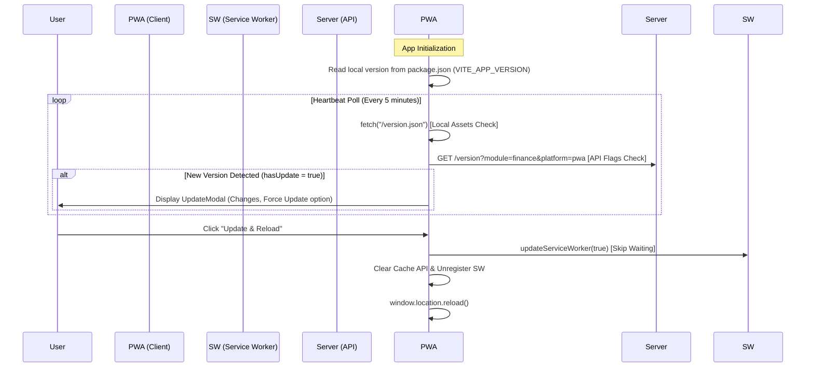

# Handover Guide: Unclutter PWA Version Update System

This system handles direct client-side asset caching, server-enforced API version checks, background heartbeat polling, force-update notices, and user-initiated settings checkups.

---

## 1. Core Architecture & Workflow



---

## 2. Component Breakdown

### A. The Core Service: [VersionService.ts](file:///Users/olalekan/Projects/Unclutter/unclutter-full/main/development/apps/finance/pwa/src/lib/VersionService.ts)
The coordinator instance for all update operations. It operates in **two distinct phases** to prevent caching out-of-sync app states:

1. **Phase 1: Local `version.json` check (Assets Check)**:
   - Fetches `/version.json?_={timestamp}` (a static file generated at compile time).
   - This checks if new HTML/JS/CSS assets have been uploaded to the static host.
2. **Phase 2: Central API `/version` check (Server Check)**:
   - Queries `GET /version?module=finance&platform=pwa` (with cache-busting).
   - Checks if the backend has flagged this version as deprecated or requested a `forceUpdate` (disallowing users from ignoring critical database migrations or API contract updates).

If either check yields a version higher than `import.meta.env.VITE_APP_VERSION`, it declares `hasUpdate = true`.

#### Cache Cleansing & Safe Reloads
When an update is applied via `applyUpdate()`, it runs the following cleaning cycle to guarantee a fresh load:
- Deletes all cache entries using the browser **Cache API** (`caches.delete`).
- Iterates and **unregisters all Service Workers** (`navigator.serviceWorker.getRegistrations`).
- Delays for `500ms` for browser cleanup, then forces a page reload (`window.location.reload()`).

---

### B. Background Check Hook: [ReloadPrompt.tsx](file:///Users/olalekan/Projects/Unclutter/unclutter-full/main/development/packages/ui/src/components/Feedback/ReloadPrompt.tsx)
This component runs as a background daemon registered at the root layout of the app:

* **PWA Heartbeat update**: Automatically executes a Service Worker registration check (`r.update()`) every **5 minutes**.
* **Visibility / Focus listener**: Triggers a version evaluation immediately when the tab returns to focus (`window.focus`) or changes visibility state.
* **On-Demand Event**: Listens to the `pwa-force-update` window event to trigger update prompts on-demand (useful for manually calling updates from the console or other features).

---

### C. Update Notices: [UpdateModal.tsx](file:///Users/olalekan/Projects/Unclutter/unclutter-full/main/development/packages/ui/src/components/Feedback/UpdateModal.tsx)
When `hasUpdate` is true, the `UpdateModal` overlays the application interface. It renders:
* The new version number.
* Release notes and feature list (derived from the API response payload).
* A primary action button: **Update & Reload** (triggers cache clearing and refresh).
* A close/dismiss button (**disabled** if `forceUpdate` is marked true).

---

### D. Settings Integration: [Settings.tsx](file:///Users/olalekan/Projects/Unclutter/unclutter-full/main/development/apps/finance/pwa/src/pages/settings/Settings.tsx)
The current installed version is exposed in the Settings sub-footer:
- It prints: `Version {import.meta.env.VITE_APP_VERSION || '1.0.0'}`.

#### Adding an On-Demand Check Button
To add an on-demand check button in the settings panel of a new project, invoke `versionService.checkForUpdates()` directly:

```typescript
import versionService from '@/lib/VersionService';

const handleManualCheck = async () => {
  toast.loading('Checking for updates...');
  const { hasUpdate, versionInfo } = await versionService.checkForUpdates();
  
  if (hasUpdate) {
    // Dispatch event to show ReloadPrompt UpdateModal
    window.dispatchEvent(new CustomEvent('pwa-force-update', { detail: versionInfo }));
  } else {
    toast.success('You are on the latest version!');
  }
};
```
