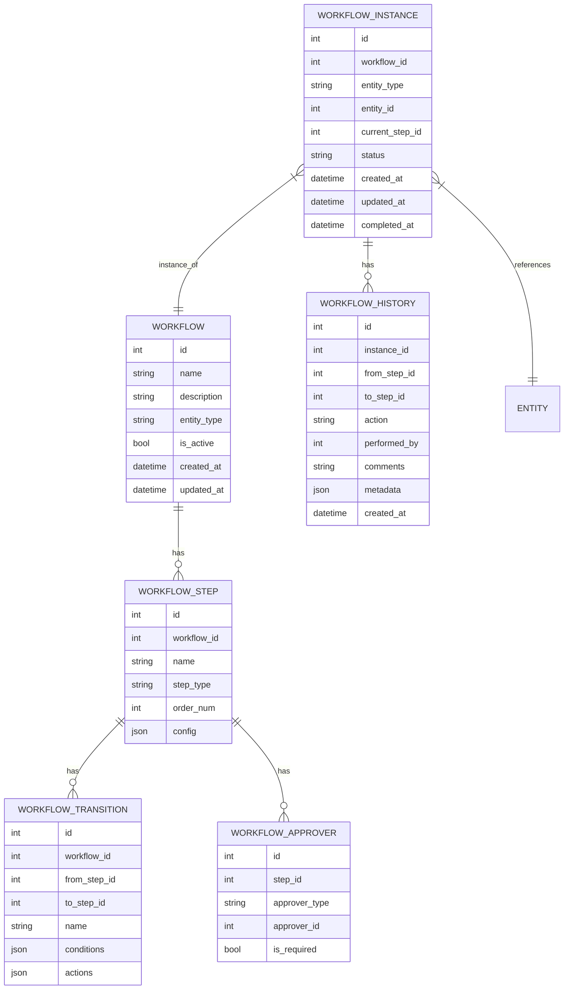

# Workflow Architecture

## Core Components

### 1. Workflow Definition
- **Workflow**: The main container for a business process (e.g., "Document Approval", "Employee Onboarding")
- **Steps**: Individual stages in the workflow (e.g., "Draft", "Review", "Approve")
- **Transitions**: Rules for moving between steps, including conditions and actions
- **Approvers**: Role-based or user-based approvers for each step

### 2. Runtime Components
- **Workflow Engine**: Executes workflow definitions and manages state transitions
- **Workflow Instance**: A running instance of a workflow for a specific entity
- **Task Queue**: Manages pending tasks for users/groups
- **Event System**: Handles workflow-related events and triggers

## Data Model

## Integration with Request System

The Workflow Engine provides the foundation for the Request System's approval processes:

1. **Request Types** map to Workflow definitions
2. **Approval Flows** are implemented as Workflow Steps and Transitions
3. **Request Status** is managed by the Workflow Engine's state machine
4. **Approval Tasks** are created based on Workflow Step assignments

## Event System

The workflow engine emits events at key points in the workflow lifecycle:

- `workflow.started` - When a new workflow instance is created
- `workflow.step.changed` - When a workflow moves to a new step
- `workflow.completed` - When a workflow reaches a final state
- `workflow.approval.required` - When approval is needed
- `workflow.approval.received` - When an approval is given

## Security

- Role-based access control for workflow definitions
- Permission checks for workflow actions
- Audit logging of all workflow activities
- Data validation and sanitization at all levels
